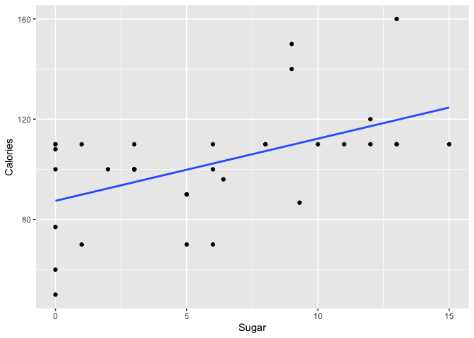

PS07
================

## GitHub Documents

Welcome to my first github! I am a current sophomore at Smith College
studying Quantitative Economics and Statstical & Data sciences.

## Sample of my work

You can include R code in the document as follows:

``` r
library(ggplot2)
library(moderndive)
library(Stat2Data)
data("Cereal")
```

Creating a model of the calories per serving of a cereal as a multiple
regression function of the amount of sugar per serving (in grams).

``` r
lR_cereal <- lm(Calories ~ Sugar, data = Cereal)
LR_Cereal_points <- get_regression_points(lR_cereal)
get_regression_table(lR_cereal)
```

    ## # A tibble: 2 × 7
    ##   term      estimate std_error statistic p_value lower_ci upper_ci
    ##   <chr>        <dbl>     <dbl>     <dbl>   <dbl>    <dbl>    <dbl>
    ## 1 intercept    87.4      5.16      16.9    0        76.9     97.9 
    ## 2 Sugar         2.48     0.707      3.51   0.001     1.04     3.92

## Including Plots

I will plot the model I created above on a scatterplot of the observed
data points

<!-- -->
